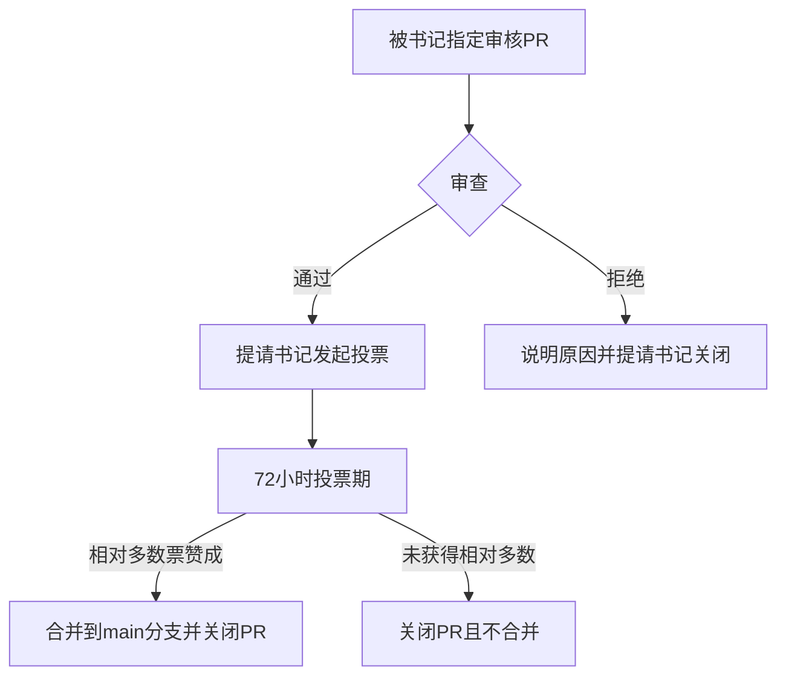

# 编辑工作手册

## 审稿流程

```mermaid
graph TD
    A[被书记指定审核PR] --> B{审查}
    B -->|通过| C[提请书记发起投票]
    B -->|拒绝| D[说明原因并提请书记关闭]
    C --> E[72小时投票期]
    E -->|相对多数票赞成| F[合并到main分支并关闭PR]
    E -->|未获得相对多数| G[关闭PR且不合并]
```

## 修改标准
1. **内容审查**
   - 准确性
   - 词条关联性

2. **技术规范**
   - 链接格式：`[[正确词条名]]`
   - 避免死链（链接词条必须存在或已投稿）

## 分支管理
- `main`：仅包含已发布内容
